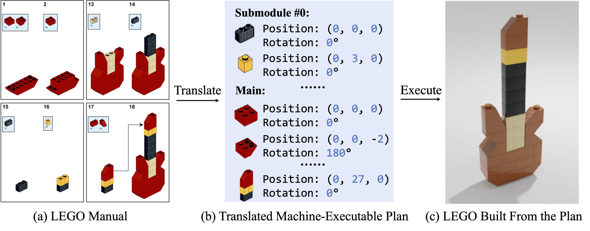

# Translating a Visual LEGO Manual to a Machine-Executable Plan

This is the PyTorch implementation for the paper:

**Translating a Visual LEGO Manual to a Machine-Executable Plan**

<br />
[Ruocheng Wang](https://cs.stanford.edu/~rcwang/),
[Yunzhi Zhang](https://cs.stanford.edu/~yzzhang/),
[Jiayuan Mao](http://jiayuanm.com/),
[Chin-Yi Cheng](),
[Jiajun Wu](https://jiajunwu.com/)
<br />
In European Conference on Computer Vision (ECCV) 2022
<br />
[[project]](https://cs.stanford.edu/~rcwang/projects/lego_manual/)

# Installation

Run the following commands to install necessary dependencies.

```
conda create -n lego_release python=3.9.12
conda activate lego_release
pip -r requirements.txt
```

You may need to manually install `pytorch3d 0.5.0` according to
this [tutorial specifically for this verion](https://github.com/facebookresearch/pytorch3d/blob/4046677cf1f8a6e5e9f9e8ef43e5c25200183c64/INSTALL.md).

# Evaluation

Download the evaluation datasets and model checkpoints
from [here](https://office365stanford-my.sharepoint.com/:f:/g/personal/rcwang_stanford_edu/Eh3SFTyJXY5Iib-qnc55ZnIB05tYvHZ03FgfdRYMpSospw), and unzip them under the root directory of the code. Then simply run

```
bash scripts/eval/eval_all.sh
```

from the root directory. Results will be saved to `results/`.

# Training

To train our model from scratch, first download the training and validation datasets
from [here](https://office365stanford-my.sharepoint.com/:f:/g/personal/rcwang_stanford_edu/Eh3SFTyJXY5Iib-qnc55ZnIB05tYvHZ03FgfdRYMpSospw), and unzip them to `data/datasets/synthetic_train` and `data/datasets/synthetic_val` respectively.

After downloading the datasets, preprocess them by running

```
bash scripts/process_dataset.sh
```

Then run the script to train our model

```
bash scripts/train/train_mepnet.sh
```

You can add `--wandb` option in the training script for logging and visualization in [wandb](https://wandb.ai/site). We
train our model on 4 Titan RTX GPUs for 5 days.

# Acknowledgements

Some of our code is built on top of [CycleGAN](https://github.com/junyanz/pytorch-CycleGAN-and-pix2pix)
and [CenterNet](https://github.com/xingyizhou/CenterNet). If you encounter any problem, please don't hesitate to email
me at rcwang@stanford.edu or open an issue.
